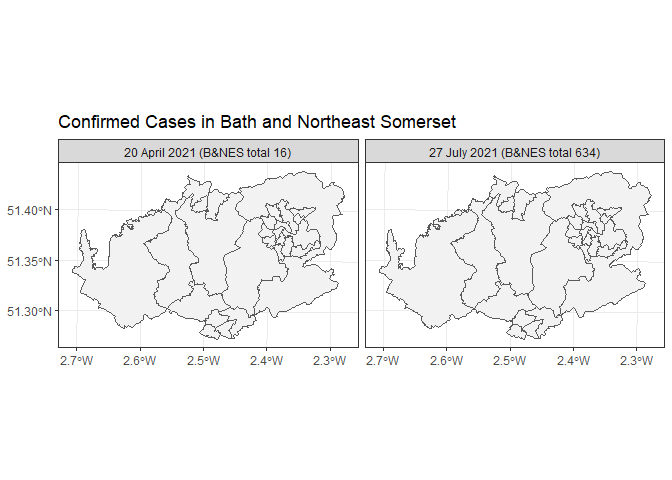

```r
library(tidyverse)
library(sf)
```


Read in the polygon (you will need to download from the data folder first).

```r
map_MSOA = st_read('./data/Middle_Layer_Super_Output_Areas_2011/Middle_Layer_Super_Output_Areas_2011.shp')
```

```
## Reading layer `Middle_Layer_Super_Output_Areas_2011' from data source 
##   `C:\Users\trs35\OneDrive - University of Bath\SummerSchool\SpatialHealthOGH\Challange_Question\Data\Middle_Layer_Super_Output_Areas_2011\Middle_Layer_Super_Output_Areas_2011.shp' 
##   using driver `ESRI Shapefile'
## Simple feature collection with 7201 features and 6 fields
## Geometry type: MULTIPOLYGON
## Dimension:     XY
## Bounding box:  xmin: 82679.8 ymin: 5343.899 xmax: 655604.7 ymax: 657534.1
## Projected CRS: OSGB 1936 / British National Grid
```

```r
MSOA_bath = map_MSOA[grep('Bath', map_MSOA$msoa11nm),]
```

Download the case data for Bath from UK Covid dashboard API.
First MSOA-level data:  rolling seven day totals, released once per week.
Missing rows mean censored data (counts = 0, 1, or 2).
 

```r
cases_bath_msoa = read_csv('https://api.coronavirus.data.gov.uk/v2/data?areaType=msoa&areaCode=E06000022&metric=newCasesBySpecimenDateRollingSum&format=csv')
```

```
## Rows: 871 Columns: 11
```

```
## -- Column specification --------------------------------------------------------
## Delimiter: ","
## chr  (9): regionCode, regionName, UtlaCode, UtlaName, LtlaCode, LtlaName, ar...
## dbl  (1): newCasesBySpecimenDateRollingSum
## date (1): date
```

```
## 
## i Use `spec()` to retrieve the full column specification for this data.
## i Specify the column types or set `show_col_types = FALSE` to quiet this message.
```

Next get data for the whole local authority: rolling seven day totals, released daily.

```r
cases_bath_all = read_csv('https://api.coronavirus.data.gov.uk/v2/data?areaType=utla&areaCode=E06000022&metric=newCasesBySpecimenDateRollingSum&format=csv')
```

```
## Rows: 519 Columns: 5
```

```
## -- Column specification --------------------------------------------------------
## Delimiter: ","
## chr  (3): areaCode, areaName, areaType
## dbl  (1): newCasesBySpecimenDateRollingSum
## date (1): date
```

```
## 
## i Use `spec()` to retrieve the full column specification for this data.
## i Specify the column types or set `show_col_types = FALSE` to quiet this message.
```
Note: The UK covid-19 API is sometimes down. These above data sets are also available 
in the data folder on GitHub. 
  
  * weely_cases_bath_MSOA contains the MSOA-level rolling seven day totals, released every week.
  * daily_cases_bath_total contains the rolling seven day totals for the whole local authority, released daily

 
Now I extract data for one low week between peaks in April 2021 (lots of censoring)
and one peak week in July 2021 to demonstrate the censoring problem.

```r
low_week = filter(cases_bath_msoa, as.character(date) == '2021-04-20')%>%
  select(areaCode, April_2021 = contains('Cases'))


high_week = filter(cases_bath_msoa, as.character(date) == '2021-07-27')%>%
  select(areaCode, July_2021 = contains('Cases'))

low_week
```

```
## # A tibble: 2 x 2
##   areaCode  April_2021
##   <chr>          <dbl>
## 1 E02002991          3
## 2 E02002997          3
```

```r
high_week
```

```
## # A tibble: 27 x 2
##    areaCode  July_2021
##    <chr>         <dbl>
##  1 E02002985        26
##  2 E02002986        41
##  3 E02002987        21
##  4 E02002988        17
##  5 E02002989        13
##  6 E02002990        22
##  7 E02002991        27
##  8 E02002992        28
##  9 E02002993        22
## 10 E02002994        32
## # ... with 17 more rows
```


Next check the total counts for these weeks, and save some labels for plots later.

```r
filter(cases_bath_all, as.character(date) == '2021-04-20' | as.character(date) ==  '2021-07-27')
```

```
## # A tibble: 2 x 5
##   areaCode  areaName                     areaType date       newCasesBySpecimen~
##   <chr>     <chr>                        <chr>    <date>                   <dbl>
## 1 E06000022 Bath and North East Somerset utla     2021-07-27                 634
## 2 E06000022 Bath and North East Somerset utla     2021-04-20                  16
```

```r
wk.labs <- c("20 April 2021 (B&NES total 16)", "27 July 2021 (B&NES total 634)")
names(wk.labs) <- c("April_2021", "July_2021")
```

Now I merge with MSOA geometry and reshape the data structure a bit to make plotting easier

```r
MSOA_bath = left_join(MSOA_bath, low_week, by = c('msoa11cd' = 'areaCode'))%>%
  left_join(high_week,by = c('msoa11cd' = 'areaCode'))

msoab2 = select(MSOA_bath, April_2021, July_2021, geometry) %>% 
  gather(week, cases, -geometry)
```

Finally I make an unfancy plot, which shows the general problem 


```r
ggplot() + 
  geom_sf(data = msoab2, aes(fill = cases)) + 
  scale_fill_continuous(low="thistle2", high="darkred",
                        guide="colorbar",na.value="gray95")+
  facet_wrap(~week, ncol = 2, labeller = labeller(week = wk.labs))+
  theme_bw()+ ggtitle('Confirmed Cases in Bath and Northeast Somerset')
```

<!-- -->
